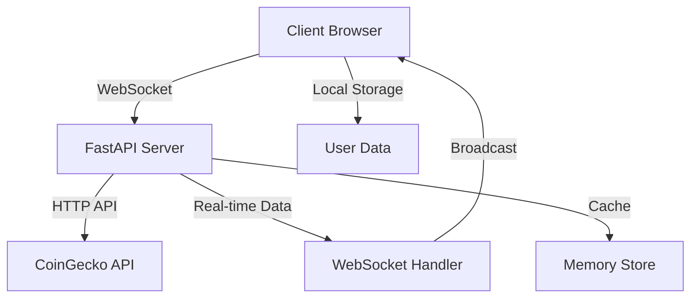

<div align="center">

# 🚀 Crypto Trading Dashboard Pro 
### *Real-time Cryptocurrency Trading & Analytics Platform*


---


</div>

## 📊 **MARKET OVERVIEW**

```
┌─────────────────────────────────────────────────────────────┐
│  🔥 LIVE CRYPTO DASHBOARD - REAL-TIME MARKET DATA 🔥        │
├─────────────────────────────────────────────────────────────┤
│  ⚡ WebSocket Connections: ACTIVE                           │
│  📈 Supported Cryptos: 22+ Major Coins                     │
│  🔄 Update Frequency: Real-time (1s intervals)             │
│  💹 Historical Data: 365 days back                         │
│  🎯 Features: Portfolio, Alerts, Analytics                 │
└─────────────────────────────────────────────────────────────┘
```

## ✨ **FEATURES**

<div align="center">

| 🎯 **CORE FEATURES** | 📊 **ANALYTICS** | 🔔 **ALERTS** |
|:---:|:---:|:---:|
| Real-time Price Tracking | Interactive Charts | Price Alerts |
| Portfolio Management | Technical Indicators | Market Notifications |
| Favorites System | Historical Analysis | Custom Triggers |
| Search & Filter | Volume Analysis | Email Integration |

</div>

### 🚀 **Real-time Market Data**
- ⚡ Live price updates via WebSocket
- 📈 Interactive Chart.js visualizations
- 🔄 Automatic refresh every second
- 💰 Multi-currency support (USD, EUR)

### 💼 **Portfolio Management**
- 📊 Track your crypto holdings
- 💹 Real-time P&L calculations
- 📈 Performance analytics
- 🎯 Investment tracking

### 🔔 **Smart Alerts System**
- 🚨 Price threshold notifications
- 📱 Browser notifications
- 📧 Email alerts (configurable)
- ⏰ Custom time-based alerts

### 🛠️ **Professional Tools**
- 🧮 Currency converter
- 📊 P&L calculator
- 📈 Technical analysis indicators
- 🎯 Support/Resistance levels

## 🏗️ **ARCHITECTURE**



## 🚀 **QUICK START**

### 1️⃣ **Installation**
```bash
# Clone the repository
git clone https://github.com/your-username/crypto-trading-dashboard.git

# Navigate to project directory
cd crypto-trading-dashboard

# Install dependencies
pip install -r requirements.txt
```

### 2️⃣ **Launch**
```bash
# Start the trading dashboard
python main.py

# Access your dashboard
🌐 http://localhost:5000
```

### 3️⃣ **Deploy on Replit**
<div align="center">

[](https://replit.com/@your-username/crypto-trading-dashboard)

</div>

## 📁 **PROJECT STRUCTURE**

```
crypto-trading-dashboard/
├── 🐍 main.py              # FastAPI server & WebSocket handler
├── 📁 static/
│   ├── 🌐 index.html       # Main dashboard interface
│   ├── ⚡ app.js           # Frontend logic & WebSocket
│   └── 🎨 styles.css       # Modern trading UI styles
├── 📋 requirements.txt     # Python dependencies
├── ⚙️ .replit             # Replit configuration
└── 📖 README.md           # This file
```

## 🎨 **SCREENSHOTS**

<div align="center">

### 📊 **Main Dashboard**


### 📈 **Live Charts**


</div>

## 🔧 **CONFIGURATION**

### Environment Variables
```bash
# Optional configurations
REFRESH_INTERVAL=1          # Update frequency in seconds
MAX_HISTORICAL_DAYS=365     # Historical data range
DEFAULT_CURRENCY=usd        # Base currency
```

### Supported Cryptocurrencies
```
Bitcoin (BTC)     • Ethereum (ETH)    • Binance Coin (BNB)
Cardano (ADA)     • Solana (SOL)      • Dogecoin (DOGE)
Polygon (MATIC)   • Chainlink (LINK)  • Litecoin (LTC)
... and 13 more major cryptocurrencies
```

## 📊 **API ENDPOINTS**

| Method | Endpoint | Description |
|:------:|:---------|:------------|
| `GET` | `/` | Main dashboard interface |
| `WS` | `/ws` | WebSocket for real-time data |
| `GET` | `/api/portfolio` | Portfolio data |
| `POST` | `/api/alerts` | Create price alerts |

## 🛡️ **SECURITY FEATURES**

- 🔒 **Secure WebSocket connections**
- 🛡️ **Input validation & sanitization**
- 💾 **Local storage encryption**
- 🚨 **Error handling & logging**

## 🎯 **ROADMAP**

- [ ] 🔐 User authentication system
- [ ] 📱 Mobile app version
- [ ] 🤖 AI-powered trading signals
- [ ] 📊 Advanced charting tools
- [ ] 🔄 Auto-trading features
- [ ] 📈 Social trading features

## 🤝 **CONTRIBUTING**

<div align="center">

[](https://github.com/your-username/crypto-trading-dashboard/graphs/contributors)

</div>

1. 🍴 Fork the repository
2. 🌿 Create your feature branch (`git checkout -b feature/AmazingFeature`)
3. 💾 Commit your changes (`git commit -m 'Add some AmazingFeature'`)
4. 📤 Push to the branch (`git push origin feature/AmazingFeature`)
5. 🔄 Open a Pull Request

## 📜 **LICENSE**

This project is licensed under the MIT License - see the [LICENSE](LICENSE) file for details.

## 🙏 **ACKNOWLEDGMENTS**

- 🏆 **CoinGecko API** for reliable market data
- 📊 **Chart.js** for beautiful visualizations
- ⚡ **FastAPI** for high-performance backend
- 🎨 **Modern CSS** for sleek UI design

---

<div align="center">

### 🚀 **READY TO START TRADING?**


[](https://replit.com/new)
[](https://github.com/your-username/crypto-trading-dashboard)

**Made with ❤️ for the crypto trading community**


</div>

---

<div align="center">
<sub>🔥 Built with FastAPI • WebSocket • Chart.js • Modern CSS 🔥</sub>
</div>
